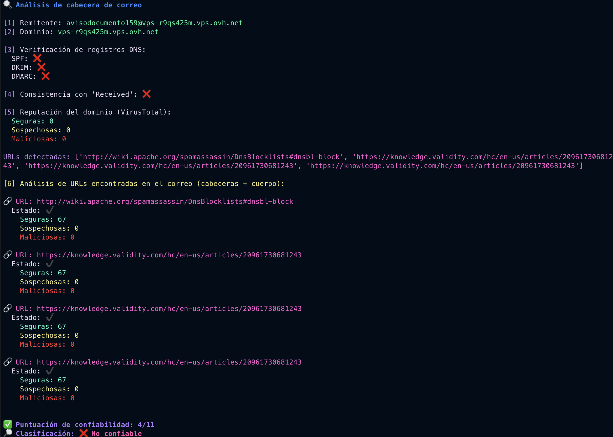

🛡️ Email Header Analyzer + URL Reputation with VirusTotal
This Python script allows you to analyze the header and body of an email directly from the terminal, without needing to upload .eml files. Its purpose is to help you assess the trustworthiness of a message by detecting manipulation, missing authentication, domain reputation, and the presence of suspicious URLs.

🚀 How does it work?
Paste the entire email (header and body) directly into the terminal.

The script automatically detects the separation between header and body.

A full analysis is performed:

Extracts the sender's domain.

Checks for SPF, DKIM, DMARC records.

Analyzes consistency in Received fields.

Queries domain reputation via VirusTotal.

Extracts and analyzes URLs from the email body using VirusTotal.

Calculates a trust score (scale from 0 to 11).

📌 Key Features
✅ Manual input (no .eml files required).

✅ Verifies domain authenticity: SPF, DKIM, DMARC.

✅ Uses the free VirusTotal API to analyze:

Domain reputation.

Reputation of URLs found in the body.

✅ Visual report with color output.

✅ Final classification of the email: trustworthy, partially trustworthy, or untrustworthy.

📸 Example Output


🔧 Requirements
Python 3.7 or higher

Free API Key from VirusTotal

Install dependencies:

bash
Copy
Edit
pip install -r requirements.txt


You said:
es en md


ChatGPT said:
Perfecto, aquí tienes el texto en formato Markdown (.md) en inglés:

markdown
Copy
Edit
# checkheaders

# 🛡️ Email Header Analyzer + URL Reputation with VirusTotal

This Python script allows you to **analyze the header and body of an email** directly from the terminal, without needing to upload `.eml` files. Its purpose is to help you assess the trustworthiness of a message by detecting manipulation, missing authentication, domain reputation, and the presence of suspicious URLs.

---

## 🚀 How does it work?

1. **Paste the entire email** (header and body) directly into the terminal.
2. The script **automatically detects** the separation between header and body.
3. A full analysis is performed:
   - Extracts the sender's domain.
   - Checks for **SPF, DKIM, DMARC** records.
   - Analyzes consistency in `Received` fields.
   - Queries domain reputation via **VirusTotal**.
   - Extracts and analyzes URLs from the email body using **VirusTotal**.
   - Calculates a trust score (scale from 0 to 11).

---

## 📌 Key Features

- ✅ Manual input (no `.eml` files required)
- ✅ Verifies domain authenticity: SPF, DKIM, DMARC
- ✅ Uses the free **VirusTotal API** to analyze:
  - Domain reputation
  - Reputation of URLs found in the body
- ✅ Visual report with color output
- ✅ Final classification of the email: trustworthy, partially trustworthy, or untrustworthy

---

## 📸 Example Output



---

## 🔧 Requirements

- Python 3.7 or higher  
- Free API Key from [VirusTotal](https://www.virustotal.com/)  
- Install dependencies:

```bash
pip install -r requirements.txt
